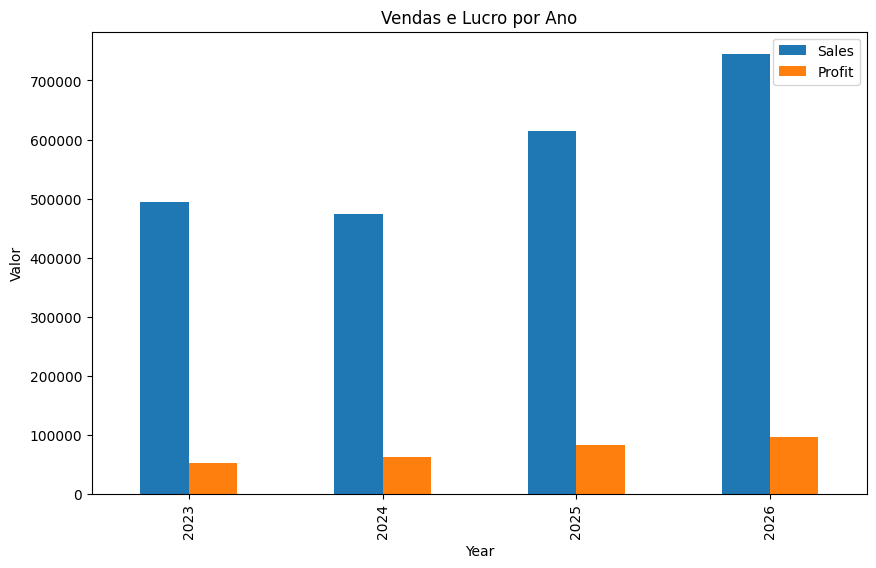
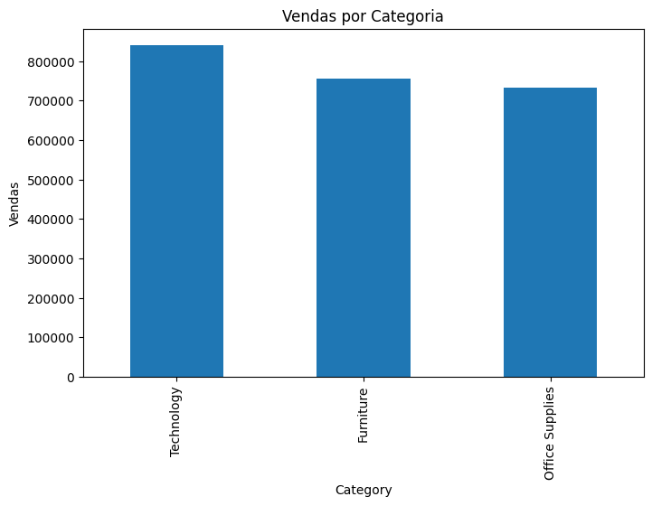
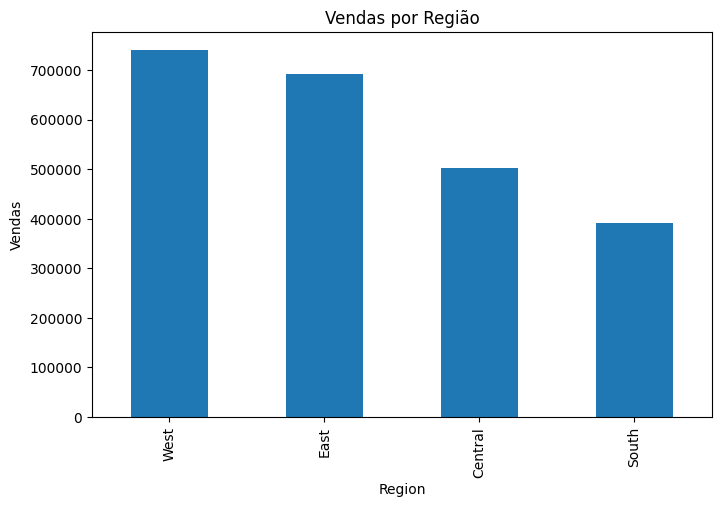
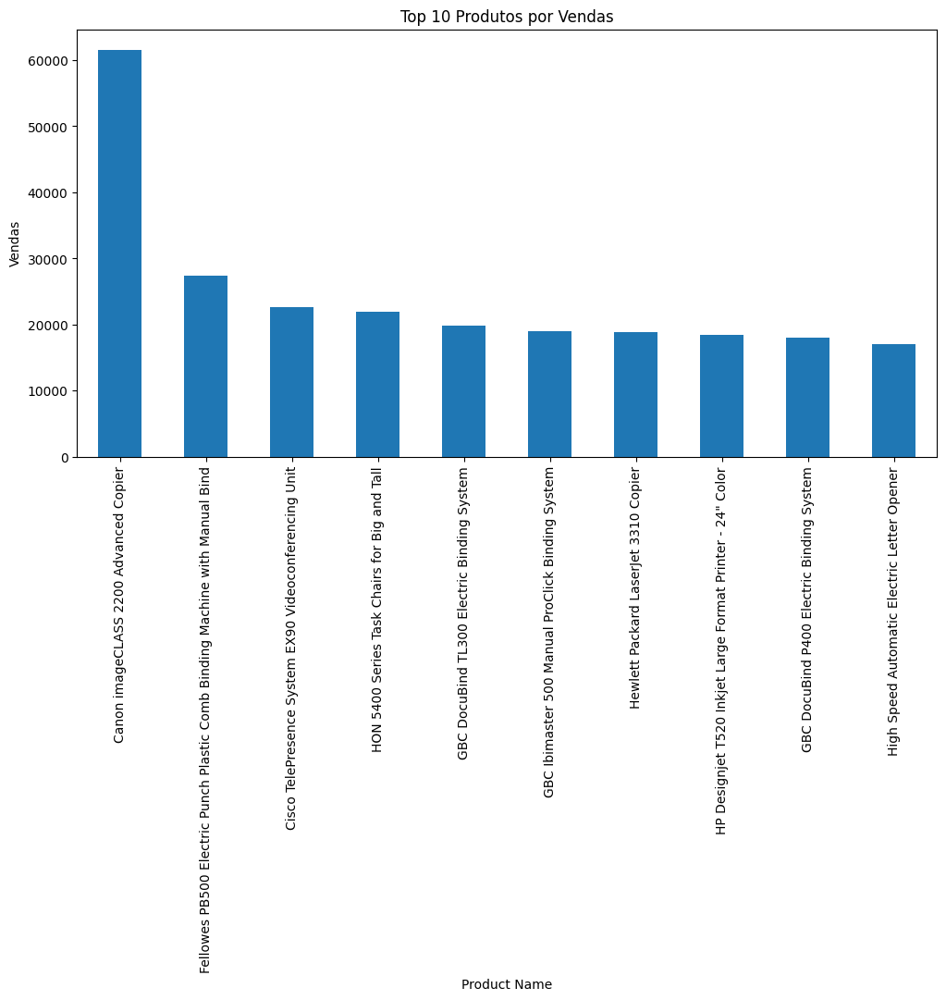
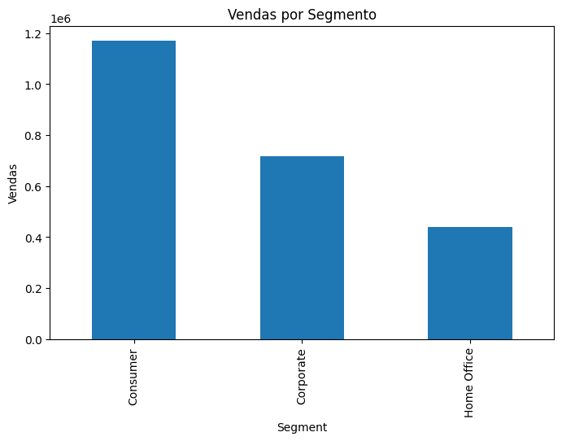

# 📊 Projeto de Análise de Dados de Vendas

## 📌 Objetivo do Projeto

Este projeto tem como objetivo analisar dados de vendas para identificar padrões de receita, lucro, comportamento de clientes e desempenho logístico. A análise busca responder perguntas de negócio relevantes utilizando técnicas de análise de dados.

---

## 🛠 Ferramentas Utilizadas

- Python
- Pandas
- Matplotlib
- SQL
- Power BI

---

## 📂 Estrutura do Projeto

analise-vendas-superstore

data/
notebooks/
sql/
dashboard/
images/
README.md

---

## ❓ Perguntas de Negócio

1. Como as vendas evoluíram ao longo do tempo?
2. Quais categorias de produtos geram mais receita?
3. Quais regiões apresentam maior volume de vendas?
4. Quais produtos são mais lucrativos?
5. Quais segmentos de clientes compram mais?
6. Qual é o tempo médio de entrega dos pedidos?

---

## 📊 Principais Análises

### Vendas por Ano

---

### Lucro por Categoria

---

### Vendas por Região

---

### Produtos Mais Lucrativos

---

### Segmento de Clientes

---

### Tempo Médio de Entrega

---

## 📈 Principais Insights

- A categoria **Tecnologia** apresentou maior volume de vendas.
- Algumas regiões concentram maior volume de pedidos.
- Determinados produtos apresentam margens de lucro superiores.
- O tempo médio de entrega permite avaliar eficiência logística.

---

## 👨‍💻 Autor

Murillo Bernardes

