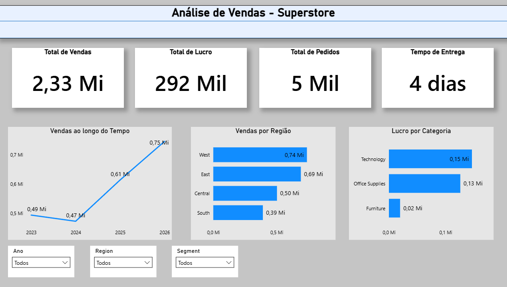
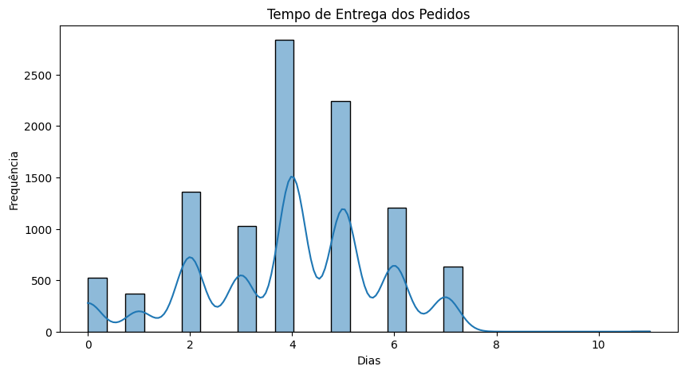

# 📊 Projeto de Análise de Dados de Vendas

Projeto de análise de dados utilizando **Python, SQL e Power BI** para explorar o desempenho de vendas da base Superstore.

---

# 📊 Dashboard

O dashboard permite analisar:

- evolução das vendas ao longo do tempo
- desempenho por região
- lucratividade por categoria
- volume de pedidos
- tempo médio de entrega

---

# 🎯 Objetivo do Projeto

Este projeto tem como objetivo analisar dados de vendas para identificar padrões de receita, lucro, comportamento de clientes e desempenho logístico.

A análise busca responder perguntas de negócio relevantes utilizando técnicas de análise de dados.

---

# 🛠️ Ferramentas Utilizadas

- Python
- Pandas
- Matplotlib
- SQL
- Power BI

---

# 📂 Estrutura do Projeto

analise-vendas-superstore/

data/
notebooks/
sql/
powerbi/
images/
README.md

---

# Análise Exploratória dos Dados

Durante a etapa exploratória foram analisados padrões de distribuição e comportamento das variáveis.

---

# ❓ Perguntas de Negócio

1. Qual é o total de vendas e lucro por ano?
2. Quais são os produtos mais lucrativos?
3. Qual categoria gera mais receita?
4. Qual região gera mais vendas?
5. Qual segmento de cliente compra mais?
6. Qual é o tempo médio de entrega dos pedidos?

---

# 📈 Principais Insights

- A categoria *Technology* apresentou maior volume de vendas.
- Algumas regiões concentram maior volume de pedidos.
- Determinados produtos apresentam margens de lucro superiores.
- O tempo médio de entrega permite avaliar eficiência logística.

---

# 👨‍💻 Autor

Murillo Bernardes

